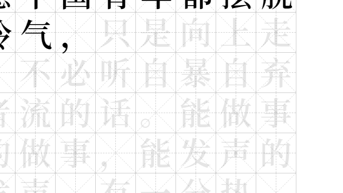
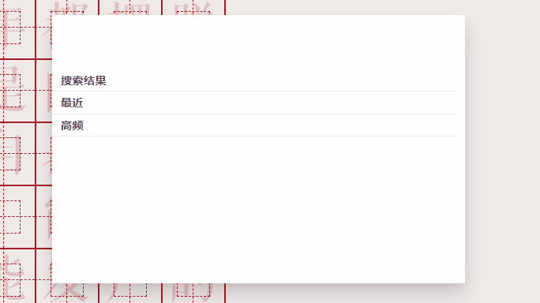

# 介绍 | Intro
一个汉字练习程序 - A Chinese typing practice program!🎉  
足够流畅，更合理的练习曲线，能方便、快速的反查汉字，多个维度的统计以及时刻感受到汉字的美。

 [||||||||----------current-progress--------------] 

# 特性 | Features

<strong>目录 | Contents</strong> 
<a href="#一、打字练习"> 一、打字练习</a> 
<a href="#二、修正墨点"> 二、修正墨点</a> 
<a href="#三、五笔反查"> 三、五笔反查</a> 
<a href="#四、汉字预览"> 四、汉字预览</a> 
<a href="#五、纸面规格"> 五、纸面规格</a> 

#### 一、打字练习  
> 支持多字键入  
  

#### 二、修正墨点
> 修正次数越多，墨渍也会越大
  

#### 三、五笔反查
> 按<kbd>Ctrl</kbd>+<kbd>E</kbd>唤出命令面板  
  

#### 四、汉字预览
> 当前展示98五笔字根、简码和汉字拼音

#### 五、纸面规格
> 作文格，田字格，米字格，回字格，九宫格

# 计划 | Todo
这里有近期开发任务的概括和一些灵感来源👉[Tian's Project](https://github.com/users/dyl0010/projects/4)

# 感谢 | Thanks
